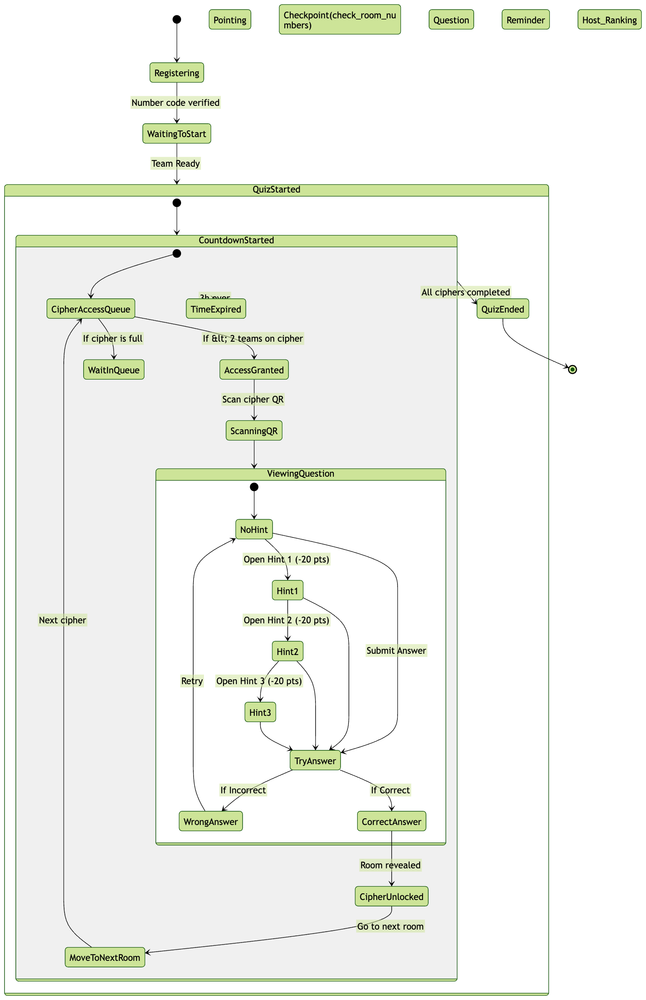

# Science Lab 2025: Hackathon Game

**Interactive science-themed web game built for the Science Lab 2025 hackathon**

🌐 **Live Demo:** https://hackagame.netlify.app/

A fun, browser-based game that combines science concepts with engaging gameplay — created during the Science Lab 2025 hackathon.

## Features

- Responsive design (desktop + mobile)
- Material UI components for clean & modern look
- Client-side routing with React Router
- QR code scanning integration (using html5-qrcode)
- Smooth animations and interactive elements
- Science-inspired challenges / mini-games

## Tech Stack

- **Framework**: React
- **UI Library**: Material-UI (@mui/material)
- **Routing**: react-router-dom
- **QR Scanner**: html5-qrcode
- **Linting**: ESLint + eslint-plugin-import
- **Hosting**: Netlify

## Architecture

The following diagram illustrates the overall architecture of the application:

## How to Run Locally

### Prerequisites

- Node.js ≥ 16
- npm (or yarn)

## Deployment
Deployed automatically to Netlify:

Live URL: https://hackagame.netlify.app/

Every push to the main branch triggers a new deploy

To deploy your own version:

    Fork or use this repo
    Connect it to Netlify
    Set build command: npm run build
    Publish directory: dist

## Contributors

<table>
  <tr>
    <td align="center">
      
       
      <b>Phuong Anh</b>
    </td>
    <td align="center">
      <a href="https://github.com/kelsingo">
        
         
        <b>Thuy Khue</b>
      </a>
    </td>
  </tr>
</table>

    
Made with ❤️ 
## License
MIT License

Feel free to fork, modify, and use this project for learning or further hackathons!
